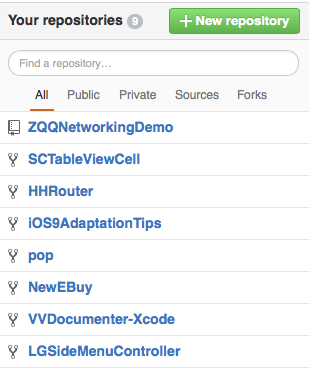

 # 以下文字转自简书

第一步：建立 `git` 仓库
----

* cd 到你的本地项目根目录下，执行 ` git `指令，此命令会在当前的目录下创建一个.git文件。

> git init /*初始化*/

第二步：将项目所有的文件添加到仓库中
----

> git add .

	这个命令会把当前路径下的所有文件，添加到待上传的文件列表中。

	如果想添加某个特定的文件，只需要把  .   换成特定的文件名即可

第三步：将add的文件 ` commit ` 到仓库
----

> git commit -m '注释语句'

第四步:去GitHub上创建自己的Repository，点击NewRepository 如下图所示：
----

	点击CreateRepository，就会进入到类似的一个页面，拿到创建的仓库的https地址

第五步：将本地的仓库关联到GitHub上
----

> git push -u origin master

	执行完后，如果没有异常，等待执行完就上传成功了，中间可能会需要输入Username和password

